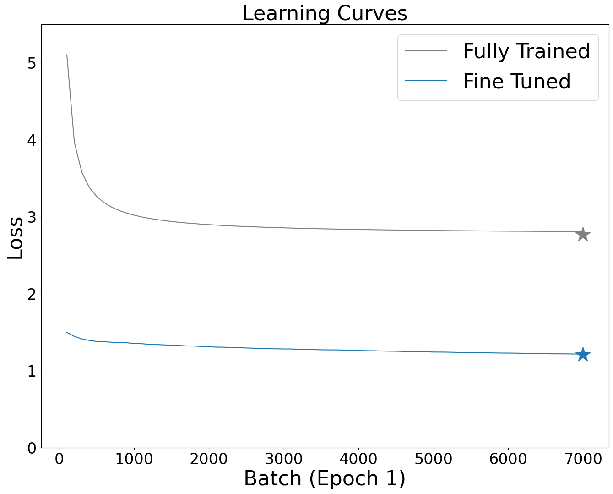

# Clip Multimedia Interaction Systems
This work serves as the evaluation project for the subject Multimedia Interaction and Systems for the Academic year 2023/2024. It contains the a full replication of the [CLIP paper]() and an applied case study in which multimodal data can be integrated in Information System research. In particular, I show how raw textual reviews and images can be used as input to predict restaurant survivability, price tier and average rating. 

## Guidelines

### Optimization
To train and evaluate CLIP models:

- Fully-train CLIP from scratch: 
`experiments/CLIP/paper_replication/train.py` 

- Fine-tune CLIP: 
`experiments/CLIP/paper_replication/fine_tune.py` 

- Zero-shot CLIP evaluation:
`experiments/CLIP/paper_replication/zero_shot_benchmark.py`

Learning Curve at Epoch1@Convergence:

The star represents the average cross-entropy loss on the test set. The lines the training loss at each batch. 

### Dataset & Embeddings
Dataset & Saved Embeddings are downloadable [here](https://drive.google.com/drive/folders/1kHT6J1kCezuNgtcCDDi8sjwEHIbR8w_p?usp=drive_link).
Embeddings should be stored in their respective folder.
Images are available for download [here](https://drive.google.com/file/d/1TtZGLRZ3sa1qwqKJ5NviZz7_PUFbr4gf/view?usp=drive_link).

### Case Study 
The case study can be replicated by configuring and running the file:

`experiments/run_experiments.py`

Change the configuration at your taste: 
```python
if __name__ == '__main__':
    embeddings = 'fully_trained' # SELECT ONE: 'zero_shot', 'fine_tuned', 'fully_trained'
    sample = 10 # DONT CHANGE 
    pretrained_model = "CLIP" # DONT CHANGE
    target = 'is_closed' # SELECT ONE: 'is_closed', 'price', 'rating'
    model_type = 'logistic' # SELECT: 'logistic' or 'regression'
    weighted = True # SELECT: True or False. For 'price' it should be False, for 'is_closed' it should be True
    if embeddings == 'zero_shot':
        path = "multi-media-interaction/experiments/CLIP/zero_shot_embeddings/zero_shot_embeddings.pkl" # Zero-shot Embeddings
    elif embeddings == 'fine_tuned':
        path = "multi-media-interaction/experiments/CLIP/fine_tuned_embeddings/fine_tuned_embeddings.pkl" # Fine-tuned Embeddings 
    elif embeddings == 'fully_trained':
        path = "multi-media-interaction/experiments/CLIP/paper_replication/fully_trained_embeddings.pkl" # Fully trained Embeddings 
    else:
        raise ValueError('Embeddings not supported.')
    data = load_data(path)
    print('Pretrained Model:', pretrained_model, 'Embeddings:', embeddings,'# Samples:', sample, 'Model:', model_type, 'Weighted:', weighted, 'Target:', target)
    fit(data, target, weighted, pretrained_model, model_type=model_type)
```